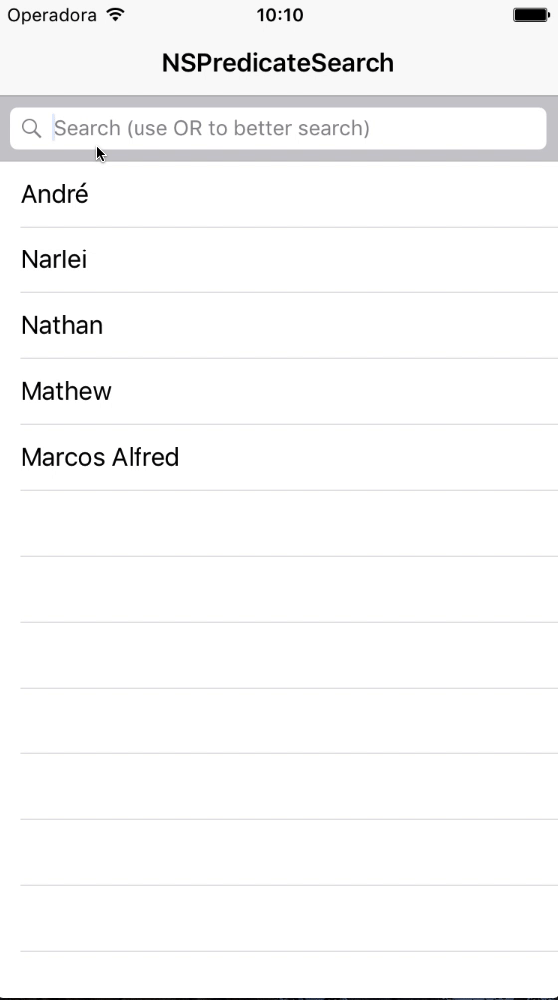

# NSPredicateSearch

A NSPredicate category to help with a dinamic Search (smart search)

[](http://cocoapods.org/pods/NSPredicateSearch)
[](http://cocoapods.org/pods/NSPredicateSearch)
[](http://cocoapods.org/pods/NSPredicateSearch)

## Running 

 


## Example

To run the example project, clone the repo, and run `pod install` from the Example directory first.


````Swift
 let predicate = NSPredicate(search: query, searchTerm: "name")
 self.array.filter(using: predicate!)
 self.array = NSMutableArray(array:self.arrayAll.filtered(using: predicate!))

````

````Objective-C
NSPredicate *predicate = [NSPredicate predicateWithSearch:searchText searchTerm:@"searchTerms"];
self.arrayData = [[NSMutableArray alloc] initWithArray:[self.arrayAllData filteredArrayUsingPredicate:predicate]];
````

## Requirements
iOS 8 +

## Installation

NSPredicateSearch is available through [CocoaPods](http://cocoapods.org). To install
it, simply add the following line to your Podfile:

```ruby
pod "NSPredicateSearch"
```

## Author

Narlei A Moreira, contato@narlei.com

## License

NSPredicateSearch is available under the MIT license. See the LICENSE file for more info.


Pay me a coffee:

[](https://www.paypal.com/cgi-bin/webscr?cmd=_donations&business=NMQM9R9GLZQXC&lc=BR&item_name=Narlei%20Moreira&item_number=development%2fdesign&currency_code=BRL&bn=PP%2dDonationsBF%3abtn_donateCC_LG%2egif%3aNonHosted)
